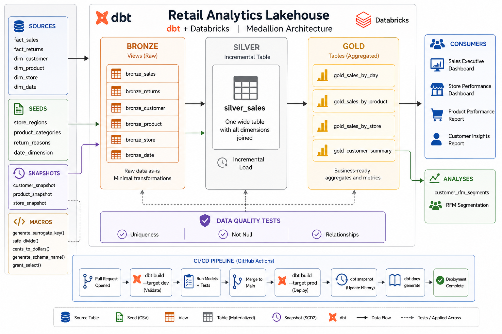

# maha_dbt — Retail Analytics Pipeline

A production-grade dbt project implementing a **Bronze → Silver → Gold** medallion architecture on **Databricks Unity Catalog**, built for a retail star schema with full SCD Type 2 history tracking, data quality tests, and CI/CD deployment.

---

## Architecture Overview



---

## Tech Stack

| Tool | Version | Purpose |
|---|---|---|
| dbt | 1.11.11 | Transformation framework |
| dbt-databricks | 1.10.9 | Databricks adapter |
| Databricks | Unity Catalog | Cloud data warehouse |
| dbt_utils | 1.3.3 | Utility macros |
| dbt_expectations | 0.10.10 | Advanced data quality tests |
| GitHub Actions | — | CI/CD pipeline |

---

## Project Structure

```
maha_dbt/
├── models/
│   ├── source/
│   │   └── sources.yml              # Source definitions (raw.source schema)
│   ├── bronze/
│   │   ├── bronze_sales.sql
│   │   ├── bronze_returns.sql
│   │   ├── bronze_customer.sql
│   │   ├── bronze_product.sql
│   │   ├── bronze_store.sql
│   │   ├── bronze_date.sql
│   │   └── properties.yml
│   ├── silver/
│   │   ├── silver_sales.sql         # Incremental wide table
│   │   └── properties.yml
│   ├── gold/
│   │   ├── gold_sales_by_day.sql
│   │   ├── gold_sales_by_product.sql
│   │   ├── gold_sales_by_store.sql
│   │   ├── gold_customer_summary.sql
│   │   └── properties.yml
│   └── exposures.yml                # Downstream consumers (dashboards, reports)
├── seeds/
│   ├── date_dimension.csv           # Q1 2024 calendar (91 rows)
│   ├── product_categories.csv       # 15 product categories
│   ├── store_regions.csv            # 10 store regions
│   └── return_reasons.csv           # 12 return reason codes
├── snapshots/
│   ├── customer_snapshot.sql        # SCD Type 2 — check strategy
│   ├── product_snapshot.sql         # SCD Type 2 — check strategy
│   └── store_snapshot.sql           # SCD Type 2 — check strategy
├── macros/
│   ├── generate_schema_name.sql     # Environment-aware schema routing
│   ├── generate_surrogate_key.sql   # MD5 surrogate key from columns
│   ├── safe_divide.sql              # Division with null-safe denominator
│   ├── cents_to_dollars.sql         # Monetary conversion utility
│   └── grant_select.sql             # Post-run grants (prod only)
├── analyses/
│   ├── revenue_trend.sql            # Monthly MoM revenue growth
│   ├── top_products.sql             # Top 10 products by revenue
│   ├── customer_rfm_segments.sql    # RFM customer segmentation
│   └── store_performance.sql        # Store ranking by region
├── .github/
│   └── workflows/
│       └── dbt_cicd.yml             # CI/CD pipeline
├── packages.yml
├── dbt_project.yml
├── profiles.yml
└── .env                             # Local environment variables (gitignored)
```

---

## Source Schema

| Table | Type | Key Columns |
|---|---|---|
| `fact_sales` | Fact | `sales_id`, `customer_sk`, `product_sk`, `store_sk`, `date_sk`, `quantity`, `unit_price`, `gross_amount`, `discount_amount`, `net_amount` |
| `fact_returns` | Fact | `sales_id`, `product_sk`, `store_sk`, `date_sk`, `returned_qty`, `return_reason`, `refund_amount` |
| `dim_customer` | Dimension | `customer_sk`, `first_name`, `last_name`, `email`, `phone`, `gender`, `loyalty_tier` |
| `dim_product` | Dimension | `product_sk`, `product_name`, `category`, `department`, `list_price` |
| `dim_store` | Dimension | `store_sk`, `store_name`, `city`, `region`, `country` |
| `dim_date` | Dimension | `date_sk`, `date`, `day`, `month`, `year`, `quarter`, `day_name`, `is_weekend` |

---

## Setup

### 1. Clone & create virtual environment

```bash
git clone https://github.com/Maha-Jr10/retail-lakehouse-dbt.git
cd retail-lakehouse-dbt
python -m venv .venv
.venv\Scripts\activate          # Windows
pip install dbt-databricks==1.10.9
```

### 2. Configure environment variables

Create a `.env` file in the `maha_dbt/` directory:

```bash
DBT_TOKEN=dapi...                          # Databricks personal access token
DBT_HOST=dbc-xxxx.cloud.databricks.com    # Databricks workspace host
DBT_HTTP_PATH=/sql/1.0/warehouses/xxxx    # SQL warehouse HTTP path
DBT_SOURCE_CATALOG=dbt_tuto_dev           # Unity Catalog containing raw source tables
DBT_PROD_CATALOG=dbt_tuto_prod            # Unity Catalog name for production models
DBT_GRANTS_ROLE=analysts                  # Databricks group to grant SELECT on silver/gold (optional)
```

Load env vars in PowerShell before running dbt:

```powershell
Get-Content .env | ForEach-Object {
    if ($_ -match '^\s*([^#][^=]+)=(.*)$') {
        [System.Environment]::SetEnvironmentVariable($matches[1].Trim(), $matches[2].Trim(), 'Process')
    }
}
```

### 3. Install dbt packages

```bash
cd maha_dbt
dbt deps
```

---

## Running the Pipeline

### Full build (dev)

```bash
dbt build
```

Runs seeds → models → tests → snapshots in dependency order. Models land in `dev_bronze`, `dev_silver`, `dev_gold` schemas.

### Full build (prod)

```bash
dbt build --target prod
```

Models land in clean `bronze`, `silver`, `gold` schemas in the prod catalog.

### Run individual layers

```bash
dbt run --select tag:bronze        # Bronze views only
dbt run --select tag:silver        # Silver incremental only
dbt run --select tag:gold          # Gold tables only
dbt snapshot                       # SCD Type 2 snapshots
dbt seed                           # Load seed CSV files
dbt test                           # Run all data tests
```

### Override variables at runtime

```bash
dbt run --vars '{"start_date": "2024-06-01"}'
```

---

## Schema Routing (dev vs prod)

The `generate_schema_name` macro controls where models land:

| Target | Bronze | Silver | Gold | Seeds | Snapshots |
|---|---|---|---|---|---|
| `dev` | `dev_bronze` | `dev_silver` | `dev_gold` | `dev_seeds` | `snapshots` |
| `prod` | `bronze` | `silver` | `gold` | `seeds` | `snapshots` |

Dev and prod are fully isolated — they never write to the same schema.

---

## Data Tests

49 tests across all layers:

| Layer | Tests |
|---|---|
| Bronze | `unique`, `not_null`, `relationships` on all primary and foreign keys |
| Silver | `unique`, `not_null` on keys and measures |
| Gold | `unique`, `not_null` on primary keys and key metrics |

---

## Snapshots (SCD Type 2)

All three dimension snapshots use the `check` strategy since source tables have no `updated_at` column. dbt automatically adds `dbt_valid_from`, `dbt_valid_to`, and `dbt_scd_id` columns. A `null` value in `dbt_valid_to` means the record is the current active version.

| Snapshot | Tracks changes to |
|---|---|
| `customer_snapshot` | `first_name`, `last_name`, `email`, `phone`, `loyalty_tier` |
| `product_snapshot` | `product_name`, `list_price`, `category`, `department` |
| `store_snapshot` | `store_name`, `region`, `city`, `country` |

---

## Macros

| Macro | Usage | Description |
|---|---|---|
| `generate_schema_name` | Auto | Routes models to correct schema per environment |
| `generate_surrogate_key(['col1','col2'])` | In models | MD5 hash of combined columns |
| `safe_divide('numerator', 'denominator')` | In models | Returns null instead of divide-by-zero error |
| `cents_to_dollars('col', precision=2)` | In models | Divides by 100, rounds to N decimal places |
| `grant_select(role='analysts')` | Post-hook | Grants SELECT in prod only — skipped if `DBT_GRANTS_ROLE` not set |

---

## Analyses

Ad-hoc SQL compiled by dbt but not materialized. Use `dbt compile --select <name>` to render the final SQL, then run it in the Databricks SQL Editor.

| Analysis | Business Question |
|---|---|
| `revenue_trend` | What is our monthly revenue and MoM growth rate? |
| `top_products` | Which 10 products drive the most revenue? |
| `customer_rfm_segments` | Which customers are Champions, Loyal, At Risk, or Lost? |
| `store_performance` | How does each store rank globally and within its region? |

---

## Documentation

```bash
dbt docs generate
dbt docs serve --port 8083
```

Opens at `http://localhost:8083` with the full DAG, column descriptions, test results, and exposure lineage.

---

## CI/CD

GitHub Actions workflow at [`.github/workflows/dbt_cicd.yml`](.github/workflows/dbt_cicd.yml):

| Trigger | Action |
|---|---|
| Pull Request → `main` | `dbt build --target dev` — validates the change before merge |
| Merge → `main` | `dbt build --target prod` + `dbt snapshot` + `dbt docs generate` |

### Required GitHub Secrets

Go to **Settings → Secrets and variables → Actions** and add:

| Secret | Description |
|---|---|
| `DBT_TOKEN` | Databricks personal access token |
| `DBT_HOST` | Databricks workspace host (e.g. `dbc-xxxx.cloud.databricks.com`) |
| `DBT_HTTP_PATH` | SQL warehouse HTTP path |
| `DBT_SOURCE_CATALOG` | Unity Catalog containing the raw source tables |
| `DBT_PROD_CATALOG` | Production Unity Catalog name |
| `DBT_GRANTS_ROLE` | Databricks group to grant SELECT on silver/gold tables (optional) |

---

## Exposures

Four downstream consumers documented in [`models/exposures.yml`](models/exposures.yml):

| Exposure | Type | Gold tables consumed |
|---|---|---|
| Sales Executive Dashboard | Dashboard | `gold_sales_by_day`, `gold_sales_by_store`, `gold_sales_by_product` |
| Store Performance Report | Dashboard | `gold_sales_by_store` |
| Customer Insights Report | Analysis | `gold_customer_summary` |
| Product Performance Report | Analysis | `gold_sales_by_product` |

---

## Owner

**Muhammed John** — muhammedjohn3@gmail.com
